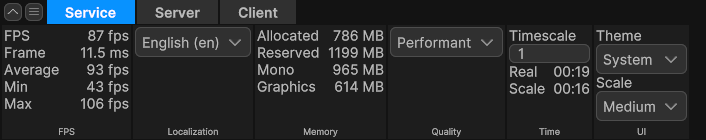

# Debug toolbar

`BovineLabs.Anchor.Debug` provides a ribbon-style host for compact diagnostics and controls. It supports managed panels discovered by attribute and ECS-backed panels whose unmanaged state is bridged through `ToolbarHelper`.



The toolbar is an AppUI feature. App UI is a direct Anchor package dependency, and the debug asmdef additionally requires:

- `UNITY_INCLUDE_INSTRUMENTATION`.

`UNITY_INCLUDE_INSTRUMENTATION` is the toolbar's sole availability gate. Unity defines it in the Editor and for Instrumented, Checked, and Debug Managed Code Variants; Release omits it. Checked and Debug also include check-only validation through `UNITY_ENABLE_CHECKS`. Select the player variant through **Managed Code Variant** in Player Settings or a build profile. Do not add Unity-owned variant symbols to scripting define settings, and do not treat the native **Development Build** flag as the variant selector.

`BovineLabs.Anchor.Debug` is not auto-referenced. Put custom panels in a debug asmdef that explicitly references `BovineLabs.Anchor`, `BovineLabs.Anchor.Debug`, `Unity.AppUI`, `Unity.Entities` for ECS panels, and any feature assemblies whose data the panel reads. Mirror the `UNITY_INCLUDE_INSTRUMENTATION` constraint so debug code does not leak into normal player builds.

Anchor's default app builder discovers the non-transient `Toolbar` service as `IAnchorToolbarHost` and calls `AnchorApp.InitializeToolbar()`. The service owns registrations, models, persistence, and filter state; each host initialization asks it for a replaceable visual root. Use the `Anchor UI.tss` theme entry point so the AppUI and toolbar style sheets are present. See [Getting started](getting-started.md) for host and theme setup.

## Choose a panel pattern

| Panel state | Pattern |
| --- | --- |
| Managed Unity API, service state, or static commands | An `[IsService]`, `[AutoToolbar]` model implementing `IToolbarElement` |
| ECS world data or controls consumed by an ECS system | `ToolbarHelper<TModel, TData>` in an `ISystem, ISystemStartStop` |

Do not introduce an ECS system solely to host a managed panel. Conversely, do not poll ECS state from a visual element when a toolbar system can publish an unmanaged snapshot.

## Managed panels with AutoToolbar

`[AutoToolbar(elementName, tabName)]` is discovered once when the durable `Toolbar` service is constructed. Put the attribute on an `[IsService]` model that implements `IToolbarElement`. `elementName` is the heading and filter name. When `tabName` is omitted, the panel uses `AnchorApp.ServiceTabName`, which defaults to `Service`.

```csharp
namespace Example.Debug
{
    using BovineLabs.Anchor;
    using BovineLabs.Anchor.Debug.Toolbar;
    using BovineLabs.Anchor.MVVM;
    using Unity.AppUI.UI;
    using Unity.Properties;
    using UnityEngine.Scripting;
    using UnityEngine.UIElements;

    [Preserve]
    [IsService]
    [AutoToolbar("Build", "Diagnostics")]
    public sealed class BuildInfoViewModel : ObservableObject, IToolbarElement
    {
        private string version;

        [Preserve]
        public BuildInfoViewModel()
        {
        }

        [CreateProperty(ReadOnly = true)]
        public string Version
        {
            get => this.version;
            set => this.SetProperty(ref this.version, value);
        }

        public VisualElement CreateElement()
        {
            return new BuildInfoView(this);
        }
    }

    public sealed class BuildInfoView : VisualElement
    {
        public BuildInfoView(BuildInfoViewModel model)
        {
            this.dataSource = model;

            var version = new Text();
            version.SetBindingToUI(nameof(Text.text), nameof(BuildInfoViewModel.Version));
            this.Add(version);

            this.schedule.Execute(() => model.Version = UnityEngine.Application.version).Every(250);
        }
    }
}
```

`IToolbarElement.CreateElement()` must return a fresh, unattached visual element every time. Toolbar root recreation retains the model and calls the factory again; it does not rediscover or reload the panel. Keep registration state, subscriptions, and resources on the model. Implement `ILoadable` when that state needs explicit setup and teardown: `Load()` runs once at registration and `Unload()` runs once at true service shutdown. Keep `[Preserve]` on attribute-discovered models and their reflected constructors for stripped player builds.

Managed polling should be modest. `Toolbar.UpdateRateSeconds` is `0.25` seconds and is a useful default for counters that do not need per-frame refresh.

## ECS-backed panels

Use three types with separate responsibilities:

- `*ToolbarSystem`: reads or writes ECS data and publishes raw unmanaged values.
- `*ToolbarViewModel`: exposes bindable managed presentation over `SystemObservableObject<TData>`.
- `*ToolbarView`: constructs compact AppUI controls and bindings.

### 1. System

```csharp
namespace Example.Debug
{
    using BovineLabs.Anchor.Debug.Toolbar;
    using Unity.Burst;
    using Unity.Entities;

    [UpdateInGroup(typeof(ToolbarSystemGroup))]
    public partial struct EntityCountToolbarSystem : ISystem, ISystemStartStop
    {
        private ToolbarHelper<EntityCountToolbarViewModel, EntityCountToolbarViewModel.Data> toolbar;

        public void OnCreate(ref SystemState state)
        {
            this.toolbar = new ToolbarHelper<EntityCountToolbarViewModel, EntityCountToolbarViewModel.Data>(ref state, "Entities");
        }

        public void OnStartRunning(ref SystemState state)
        {
            this.toolbar.Load();
        }

        public void OnStopRunning(ref SystemState state)
        {
            this.toolbar.Unload();
        }

        [BurstCompile]
        public void OnUpdate(ref SystemState state)
        {
            if (!this.toolbar.IsVisible())
            {
                return;
            }

            ref var data = ref this.toolbar.Binding;
            data.EntityCount = state.EntityManager.UniversalQuery.CalculateEntityCountWithoutFiltering();
        }
    }
}
```

`ToolbarSystemGroup` runs inside Core's `DebugSystemGroup` for default and service worlds. It skips child updates until both the durable `Toolbar` service and `AnchorApp.Current` exist.

The `ref state` constructor uses the system world's name as the toolbar tab and the second argument as the group heading and filter name. A world name ending in `World` has that suffix removed. Use the `(FixedString32Bytes tabName, FixedString32Bytes groupName)` constructor when the tab should not be world-scoped.

`IsVisible()` compares only the active toolbar tab with the helper's tab. It does not test whether the ribbon is expanded. Use it before expensive queries, but apply a separate throttle when collapsed-ribbon cost matters. Panels in different groups on the same active tab all report visible, because the ribbon presents the tab's visible groups together.

### 2. View model

```csharp
namespace Example.Debug
{
    using BovineLabs.Anchor;
    using BovineLabs.Anchor.Debug.Toolbar;
    using Unity.Properties;
    using UnityEngine.UIElements;

    public partial class EntityCountToolbarViewModel :
        SystemObservableObject<EntityCountToolbarViewModel.Data>, IToolbarElement
    {
        [CreateProperty(ReadOnly = true)]
        public int EntityCount => this.Value.EntityCount;

        public partial struct Data
        {
            [SystemProperty]
            private int entityCount;
        }

        public VisualElement CreateElement()
        {
            return new EntityCountToolbarView(this);
        }
    }
}
```

Keep `Data` unmanaged and use `[SystemProperty]` instead of public fields when bindings need notifications. Presentation stays managed: format strings, resolve textures, and localize labels in the view model or view, not in the Burst system.

For a control that writes back into `Data`, expose a normal bindable setter through the generated data property:

```csharp
[CreateProperty]
public bool Enabled
{
    get => this.Value.Enabled;
    set => this.Value.Enabled = value;
}
```

The ECS system can read the updated value on its next update.

### 3. View

```csharp
namespace Example.Debug
{
    using BovineLabs.Anchor;
    using Unity.AppUI.UI;
    using UnityEngine.UIElements;

    public sealed class EntityCountToolbarView : VisualElement
    {
        public EntityCountToolbarView(EntityCountToolbarViewModel model)
        {
            this.dataSource = model;

            var count = new Text();
            count.SetBindingToUI(nameof(Text.text), nameof(EntityCountToolbarViewModel.EntityCount));
            this.Add(count);
        }
    }
}
```

Each helper registration creates an independent model and pinned data instance, even when several worlds use the same model type. The model creates a fresh visual projection for the current toolbar root. Do not mark the view as a service or cache it on the model.

Keep panels compact. Prefer AppUI `Text` for values, `Toggle` for booleans, `ActionButton` for commands, and short row or column layouts. `KeyValueGroup.Create` is useful for a few aligned readouts; see [Adapter elements](adapter-elements.md).

## ToolbarHelper lifecycle

`Load()` performs these operations:

1. Creates a new model for this registration.
2. Restores serializable model state when enabled.
3. Pins and registers the model's unmanaged value for direct access through `Binding`.
4. Calls `ILoadable.Load()` on the model when implemented.
5. Adds the durable registration and materializes a fresh visual element when a toolbar root exists.

`Unload()` removes only that registration, disposes its current visual element, persists state, calls `ILoadable.Unload()`, unregisters the binding bridge, and releases the pin. Pair `Load()` and `Unload()` in `OnStartRunning` and `OnStopRunning`; never use `Binding` before load or after unload. Duplicate registrations of the same model type are independent, repeated removal is harmless, and registration IDs are not reused during the toolbar service lifetime.

Recreating the toolbar root disposes the old visual generation and calls each model's factory again without loading, unloading, repinning, or replacing the model. A visual element that owns callbacks, popups, or other visual resources should implement `IDisposable`; use model `ILoadable` for registration-lifetime resources.

## Persist panel settings

`ToolbarHelper` enables persistence when the view-model class has `[Serializable]`. Unity's `JsonUtility` writes the panel to PlayerPrefs under `bl.toolbar.<tab>.<group>`.

```csharp
[Serializable]
public partial class PhysicsToolbarViewModel :
    SystemObservableObject<PhysicsToolbarViewModel.Data>
{
    [CreateProperty]
    public bool DrawColliders
    {
        get => this.Value.DrawColliders;
        set => this.Value.DrawColliders = value;
    }

    [Serializable]
    public partial struct Data
    {
        [SerializeField]
        [SystemProperty]
        private bool drawColliders;
    }
}
```

Mark both the view model and nested data struct `[Serializable]`, and put `[SerializeField]` on private generated fields that must persist. Persistence is for small settings, not sampled counters or native collections.

## Native collection data

`[SystemProperty] NativeList<T>` generates a `MultiContainer<T>` property. The destination list belongs to the view model, so it must be allocated and disposed through `ILoadable`:

```csharp
using System;
using BovineLabs.Anchor;
using Unity.Collections;
using Unity.Properties;

public partial class RowsToolbarViewModel :
    SystemObservableObject<RowsToolbarViewModel.Data>, ILoadable
{
    [CreateProperty(ReadOnly = true)]
    public UIArray<Data.Row> Rows => this.Value.Rows;

    public void Load() => this.Value.Initialize();

    public void Unload() => this.Value.Dispose();

    public partial struct Data
    {
        [SystemProperty]
        private NativeList<Row> rows;

        internal void Initialize()
        {
            this.rows = new NativeList<Row>(Allocator.Persistent);
        }

        internal void Dispose()
        {
            if (this.rows.IsCreated)
            {
                this.rows.Dispose();
            }
        }

        public struct Row : IEquatable<Row>
        {
            public int Id;

            public bool Equals(Row other) => this.Id == other.Id;
        }
    }
}
```

Build a complete snapshot in a separate, system-owned `NativeList<T>` and assign it through the generated property:

```csharp
this.scratch.Clear();
// Populate scratch.
data.Rows = this.scratch;
```

The setter compares contents, copies into the view model's owned list, and notifies only on a real change. An uncreated destination list ignores assignment. Do not mutate the owned list through its getter and manually call `Notify` as the normal update path.

See [MVVM and data binding](mvvm-and-binding.md) for `Changed<T>`, `ChangedList<T>`, `UIArray<T>`, generator constraints, and the underlying binding lifecycle.

## Filtering and saved UI state

Toolbar groups are sorted alphabetically within a tab. The filter menu tracks group names with reference counts, so several worlds can publish a group with the same name without duplicating the filter entry. Hidden group names are stored through `ILocalStorageService` under `bl.toolbarmanager.filter.selections`.

The toolbar also persists its active tab and ribbon visibility. The `anchor.toolbar` ConfigVar controls whether the toolbar starts enabled. These host preferences are independent of per-panel `ToolbarHelper` settings.

## Guardrails

- Keep runtime data collection in the system and managed presentation in the view model or view.
- Do not call managed string formatting, localization, asset lookup, or visual-element APIs from a Burst path.
- Do not capture `ToolbarHelper.Binding` in scheduled jobs. The pointer is tied to the panel lifecycle and binding notifications are managed UI work.
- Avoid structural changes, `Run()`, `Complete()`, and broad main-thread entity loops just to populate diagnostics.
- Add an ECS query requirement only when the panel genuinely cannot operate without that optional feature.
- Do not use unfinished, commented-out toolbar code as a template. The built-in Entities and Physics panels demonstrate the supported lifecycle.
- Use the project's logging policy rather than `Debug.Log*` when a diagnostic panel itself needs logging.

## Troubleshooting

- **The toolbar is absent:** verify AppUI, the debug compile constraints, the `BovineLabs.Anchor.Debug` asmdef reference, Anchor app initialization, and the Anchor UI theme.
- **Auto-toolbar discovery rejects a type:** put `[AutoToolbar]` and `[IsService]` on a model that implements `IToolbarElement`.
- **A panel disappears after the toolbar root is rebuilt:** make `CreateElement()` return a new, unattached element instead of caching a view.
- **Two worlds show the same data:** give each ECS system its own `ToolbarHelper<TModel, TData>` lifecycle; do not share the helper or its `Binding` pointer.
- **The system runs expensive queries while hidden:** guard the work with `toolbar.IsVisible()` before collecting data.
- **A restored setting is missing:** mark the class and nested data `[Serializable]`, and serialize the private field with `[SerializeField]`.
- **A native list never updates:** allocate the destination list in `ILoadable.Load()` and assign a separate snapshot through the generated property.
